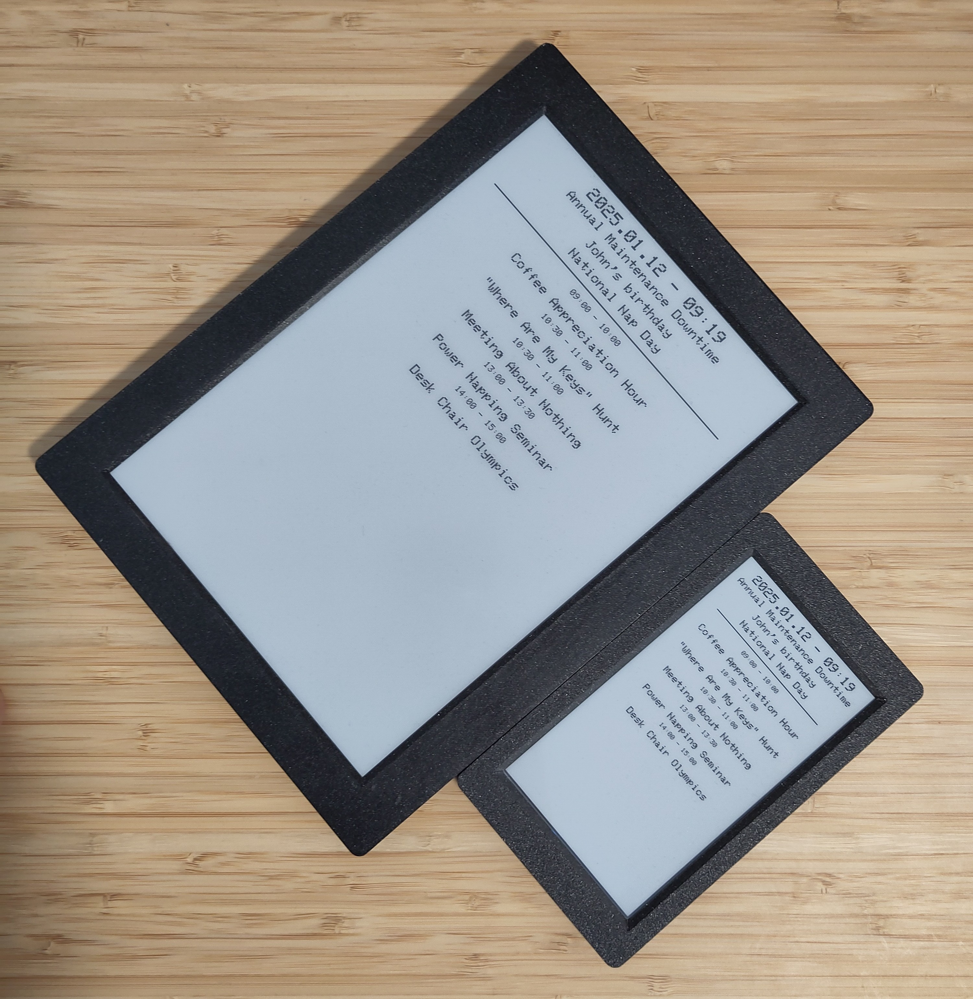
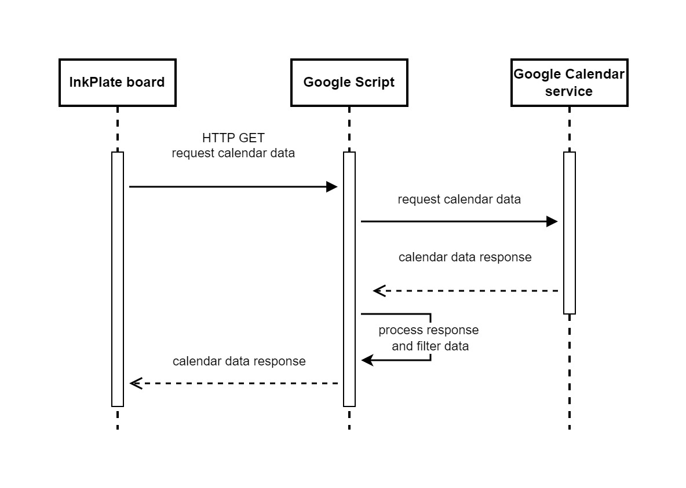
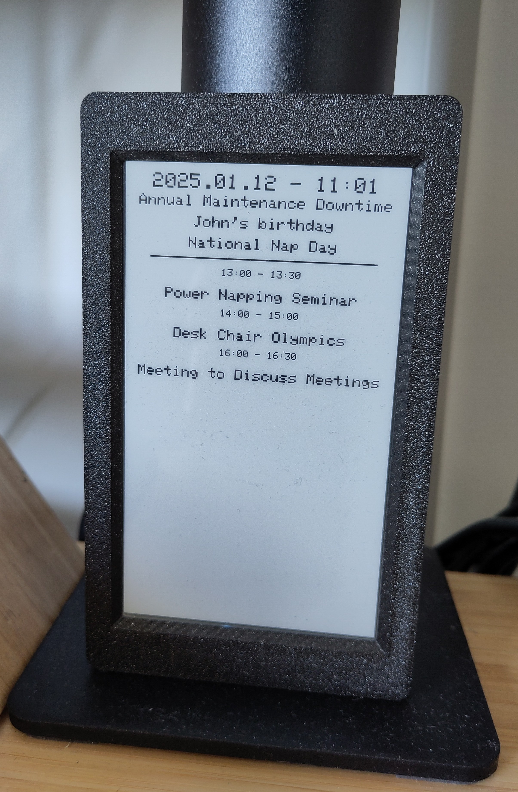
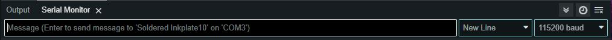
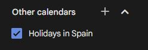

# InkCal
If you are into the micro-checkpoint lifestyle, then this tool is for you.
It is an e-ink calendar to show your Google calendar for the day. It can sit on your desk and tell your next upcoming event anytime. 😊


## Features
- **Long Battery Life:** The board can run for months on a single charge.
- **Event Support:** It displays both user-owned and invited calendar events, including all-day and short events.
- **Multi-Calendar Support:** It can pull events from multiple Google Calendars at the same time, keeping all your schedules in one place.
- **Automatic Updates:** The screen refreshes automatically when one of your event ends.
- **Manual Refresh:** Press the wake button to force a refresh—perfect for instantly updating the display after making changes to your Google Calendar.



## Hardware
It was initially designed on an [Inkplate 5](https://soldered.com/product/soldered-inkplate-5-gen2/) board, but it can handle bigger Inkplate boards too. You can buy the board with 3D-printed enclosure and battery as well, so you do not have to thinker.

## How it Works

The InkPlate board triggers HTTP requests and interacts with a Google Script to fetch the latest calendar data. 
The script processes the data by filtering events based on their type and timing, ensuring that only relevant information is returned to the board. 
The script retrieves events exclusively for the current day and includes only those that are either ongoing or scheduled to begin later that day. 
Additionally, it calculates the deep sleep intervals for the board, optimizing power usage based on sceduled screen refreshes. 
If an event has ended, the board automatically refreshes itself five minutes afterward to display the most up-to-date information.

## Usage
With InkCal, you can use your Google Calendar just as you normally would. The board automatically refreshes a few minutes after midnight, ensuring it’s updated and ready when you check your schedule in the morning. It also refreshes the screen shortly after a short event ends, ensuring your next event is always front and center. 
If you need to update your schedule for the day, just press the wake button, and the board will fetch the latest data and refresh the display.

### How to read
From top to bottom:
1. Timestamp of the last update
2. Full-day events
3. Separator line
4. Short events
    - Interval of the event
    - Title of the event



## Limitations ⚠️
- **InkPlate 5 Display Limits:** The InkPlate 5 can show up to 5 short events and 8 all-day events. If a larger InkPlate board is used, this limit could increase. Don’t worry, though—you won’t miss anything, thanks to the dynamic updates! 😊
- **Character Support:** Currently, only English characters are supported due to a limitation in the [Adafruit GFX library](https://github.com/adafruit/Adafruit-GFX-Library). Accented characters are stripped from the text. If this issue gets resolved, feel free to let me know, and I’ll look into it!
- **Screen Update Timing:** Screen updates are delayed by 5 minutes after a short event ends. However, if the board has been in deep sleep for an extended period, there might be an extra update.

## Setup
1. Use the 'calendarHelper.gs' file to set up a new Google App Script project
2. Copy the content of the the script to a new [GoogleScript](https://script.google.com/) project
3. Adjust the parameters at the top of the script (if you need to)
4. Add "Calendar" service to the Google project. The editor may ask for authorization -> Allow
5. Deploy the project. Create a real deployment, not just a 'test deployment'
6. Copy the trigger URL after the deployment. It should appear after a successful deployment
7. Test the request from a browser or other API testing tool, like [Postman](https://www.postman.com/) -> You should see your calendar events for the day with the correct timestamp
8. Paste the URL to the NetworkConfig.h and setup the SSID and password for WLAN connection
9. Open the InkCal.ino with Arduino Studio
10. Plug your Inkplate via USB and upload the code -> [InkPlate Getting started docs](https://inkplate.readthedocs.io/en/latest/get-started.html)
11. Test it and adjust the config if needed
12. Enjoy ✨

### ESP Dependencies (for the Arduino code)
- [Dasduino-Board-Definitions-for-Arduino-IDE](https://github.com/SolderedElectronics/Dasduino-Board-Definitions-for-Arduino-IDE) latest
- [Inkplate-Arduino-library](https://github.com/SolderedElectronics/Inkplate-Arduino-library)@10.0.0 or higher
- [CH340 drivers](https://soldered.com/learn/ch340-driver-installation-croduino-basic3-nova2/) latest
- ArduinoJson@7.2.1 - No guaratee that it will work with higher version without code changes

### Arduino IDE setup and common mistakes
- Inkplate is not connected to you PC when trying to upload the ESP code
- Inkplate is OFF. A light blue led should shine through the 3D-printed case next to the ON button.
- Wrong board selected. Tools -> Boards: 'Soldered Inkplate 5' or any of your choice
- Wrong port is selected. Tools -> Port. To find out the correct COM port just check the Device Manager in your operation system -> Ports -> unplug and plug your Inkplate
- Wrong parameters are selected. You should set them under the 'Tools' menu in the Arduino IDE: Programmer: EspTool, Upload speed: 921600, Flash frequency: 80MHz, Flash mode: QIO
- Inkplate is not recognized. When it is correctly connected you should see some info about the board when clicking Tools -> Get Board Info
- Logs do not appear in the Arduino IDE. Set the serial Monitor to 11520 baud

### Troubleshooting
If something isn’t working, here are a few things you can check:

1. Let's first check if the Google Script is still accessible. Open the code you used to program the board and find the calendar URL in the NetworkConfig.h file—it should start with "https://script.google...".
Copy the URL, paste it into your browser, and press **Enter**. After a few seconds, you should see a JSON response that begins with: ```{"date": ....```
If you don’t get a response, it means the deployed Google Script isn't working or isn’t reachable. In that case, try redeploying the script and reprogramming the board with the new URL.

2. If the Google Script is working correctly, you can check the board's logs for further troubleshooting.
Open Arduino Studio and connect the board to your computer using a USB cable. Then, launch the Serial Monitor by going to Tools → Serial Monitor. Ensure that the correct port is selected (Tools → Port) and that the baud rate is set to 115200 in the corner.

Now, turn on the board—you should see logs appearing in the Serial Monitor, similar to this:
``` Waiting for WiFi to connect....connected``` If the board is not able to connect, adjust you settings in the NetworkConfig.h file.

## FAQ
Q: How can I add multiple calendars?

A: Simply add another calendar by subscribing, creating, or importing it in the [Google Calendar web app](https://calendar.google.com/). As long as the calendar is selected, its events will also be displayed on the board.



---

Q: I have just updated my calendar but the changes are not reflected on the board. What to do?

A: Just push the wake button on the board and it should trigger an immediate refresh

---

Q: Does it work on bigger InkPlate boards than Inkplate 5?

A: Yes, the code can handle screen size changes responsively.

---

Q: How to use different date and time formats?

A: Just change the constants at the top of the gs file.

---

Q: What do I need to change if I choose a bigger InkPlate board?

A: Nothing if you are okay with maximum 8 all-day events and 5 short events displayed on screen. If your board can handle more, just change the numbers in the ino file:
```
#define MAX_ALL_DAY_EVENT_NUMBER 8
#define MAX_SHORT_EVENT_NUMBER 5
```
and in the Google script:
```
const maxAllDayEventNumber = 8; 
const maxShortEventNumber = 5;
```
These should match in the both code (on InkPlate and Google Script as well)

## Contribution
Any kind of positive contribution is welcome! Please help the project improve by opening an issue or a pull request with your suggested changes!

##  License
This project is licensed under the Apache License 2.0.