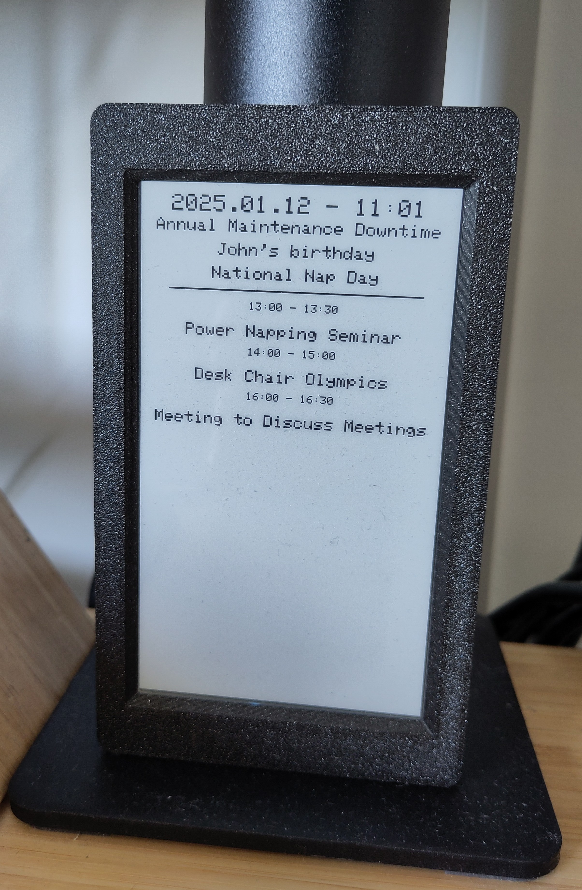
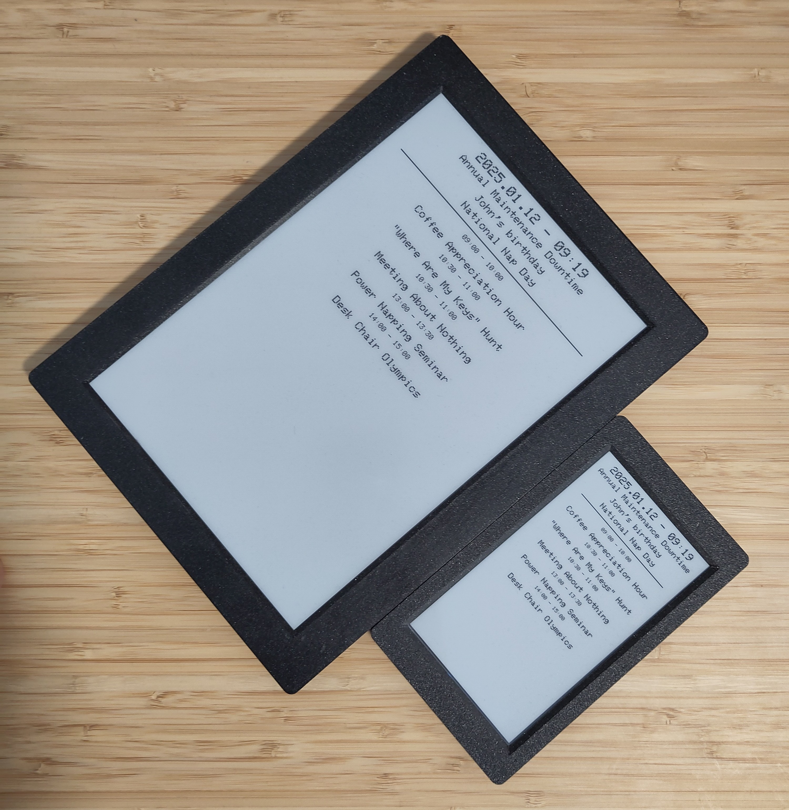
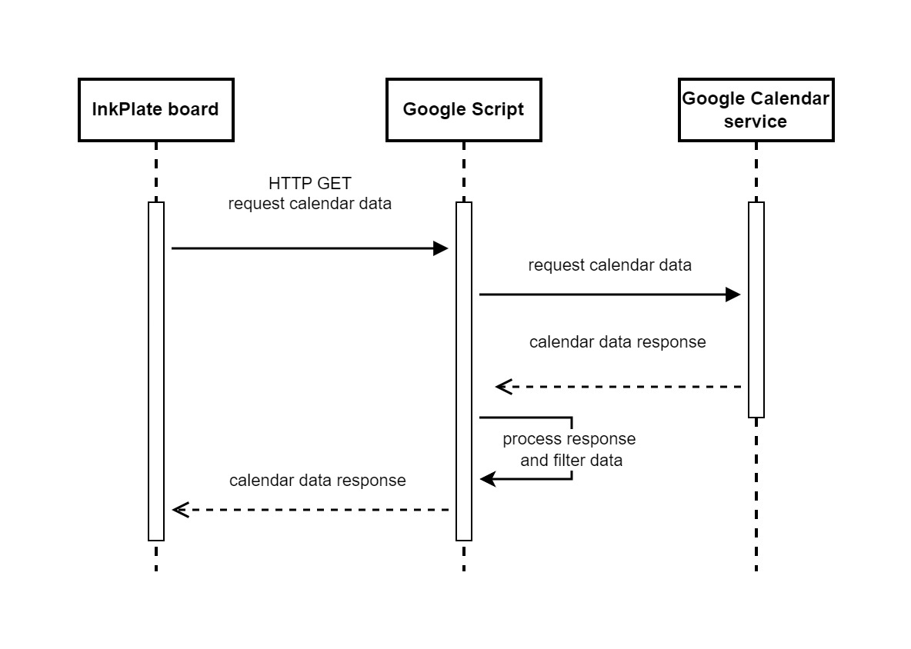

# InkCal
If you are into the micro-checkpoint lifestyle, then this tool is for you.
This is an e-ink calendar to show your Google calendar for the day. It can sit on your desk and tell your next upcoming event anytime. :)


## Features
- It runs for months with a single charge
- Able to display invited and user-owned calendar events (all-day and short events)
- It updates when your next upcoming event starts
- Able to force-refresh if wake button is pushed - useful if you updated your Google Calendar and want to see the updates on the e-ink screen immediately





## How it Works



## Hardware
It was initially designed on an [Inkplate 5](https://soldered.com/product/soldered-inkplate-5-gen2/) board but it can handle bigger Inkplate boards too. You can buy the board with 3D-printed enclosure and battery as well, so you do not have to thinker.

## Limitations
- On InkPlate5: Only displays 5 short and 8 all-day events. It could increase if bigger InkPlate board is used. But don't worry you will not miss anything because of the dynamic updates :)
- It is only able to display english characters because of the restriction of the [Adafruit GFX library](https://github.com/adafruit/Adafruit-GFX-Library). Drop me a message if it is solved and I look into it. Right now the accents are stripped from the letters.
- Updates are calculated with plus 5 minutes. So if a short event ends it will wait 5 more minutes to request for an update

## How to set it up
1. Use the 'calendarHelper.gs' file to set up a new Google App Script project
2. Copy the content of the the script to a new [GoogleScript](https://script.google.com/) project
3. Adjust the parameters at the top of the script (if you need to)
4. Add "Calendar" service to the Google project. The editor may ask for authorization -> Allow
5. Deploy the project. Create a real deployment, not just a 'test deployment'
6. Copy the trigger URL after the deployment. It should appear after a successful deployment
7. Test the request from a browser or other API testing tool, like [Postman](https://www.postman.com/) -> You should see your calendar events for the day with the correct timestamp
8. Paste the URL to the NetworkConfig.h and setup the SSID and password for WLAN connection
9. Open the InkCal.ino with Arduino Studio
10. Plug your Inkplate via USB and upload the code -> [InkPlate Getting started docs](https://inkplate.readthedocs.io/en/latest/get-started.html)
11. Test it and adjust the config if needed
12. Enjoy

## ESP Dependencies (for the Arduino code)
- [Dasduino-Board-Definitions-for-Arduino-IDE](https://github.com/SolderedElectronics/Dasduino-Board-Definitions-for-Arduino-IDE) latest
- [Inkplate-Arduino-library](https://github.com/SolderedElectronics/Inkplate-Arduino-library)@10.0.0 or higher
- [CH340 drivers](https://soldered.com/learn/ch340-driver-installation-croduino-basic3-nova2/) latest
- ArduinoJson@7.2.1 - No guaratee that it will work with higher version without code changes

## Arduino IDE setup and common mistakes
- Inkplate is not connected
- Inkplate is not ON - a light blue led should shine through the 3D-printed case next to the ON button.
- Wrong board selected. Tools -> Boards: 'Soldered Inkplate 5' or any of your choice
- Wrong port is selected. Tools -> Port. To find out the correct COM port just check the Device Manager in your operation system -> Ports -> unplug and plug your Inkplate
- Wrong parameters are selected. You should set them under the 'Tools' menu in the Arduino IDE: Programmer: EspTool, Upload speed: 921600, Flash frequency: 80MHz, Flash mode: QIO
- Inkplate is not recognized. When it is correctly connected you should see some info about the board when clicking Tools -> Get Board Info
- Logs do not appear in the Arduino IDE -> Set the serial Monitor to 11520 baud

## F.A.Q.
- I have just updated my calendar but the changes are not reflected on the board. What to do?
Just push the wake button on the board and it should trigger an immediate refresh
- Does it work on bigger InkPlate boards than Inkplate 5?
Yes, the code can handle screen size changes responsively.
- How to use different date and time formats?
Just change the constants at the top of the gs file.
- What do I need to change if I choose a bigger InkPlate board?
Nothing if you are okay with maximum 8 all-day events and 5 short events displayed on screen. If your board can handle more, just change the numbers in the ino file:
```
#define MAX_ALL_DAY_EVENT_NUMBER 8
#define MAX_SHORT_EVENT_NUMBER 5
```
and in the Google script:
```
const maxAllDayEventNumber = 8; 
const maxShortEventNumber = 5;
```
These should match in the both code (on InkPlate and Google Script as well)